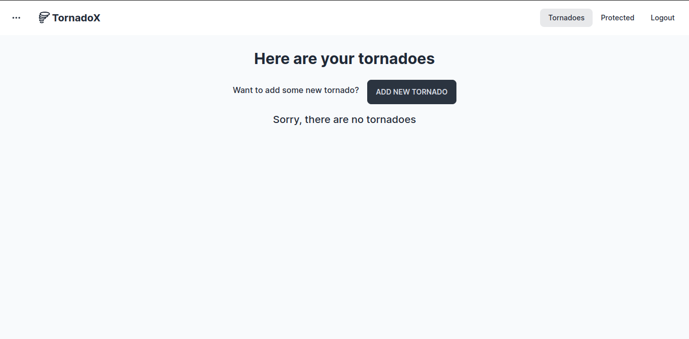

# 🌪️ TornadoX - social media app

### Description

The social media app - TornadoX - created with using NextJS, JavaScript, Formik and Yup, Tailwind with DaisyUI and last but not least Pocketbase.

The project constist of:

- user registration,
- user login,
- adding a single tornado,
- single tornado edition,
- removal of a single tornado,
- preview of a single tornado,
- protected pages for unlogged users.

All forms use Formik. The fields are reusable - custom inputs have been created, distinguishing between text input, textarea, password input (possibility to toggle between visibility of the entered password), file input and checkbox. Validation with Yup. When filling out the form, the user immediately sees feedback under each inputs if something is wrong.

With forms, feedback to the user is displayed in the form of alerts. After submitting the form, there is an automatic scroll to the top of the page where the user sees the appropriate message in the alert. Example based on new user registration. Moreover, after successfully creating a new user account, the user is redirected to the login subpage.

An unlogged user only sees "Login", "Register", "Protected" in the menu. After logging in, the user sees "Tornadoes", "Protected", "Logout". Only logged in users have access to the Protected subpage (an unlogged user will see information that they do not have the appropriate permissions to view this page).

There are two ways to enter Tornadoes:

- through the side drawer - where there is a division into the ability to view and add,

- through the top menu - where a list of all tornadoes for a given user is immediately visible (if the user does not have a single tornado added, he sees appropriate information)

If an unlogged user enters the Tornadoes section via the side drawer, he will see all users' tornadoes that have been given the "public" flag.

A logged in user can see all his tornadoes - both those marked as public and private. The user has the option to delete or edit the tornado.

A single tornado consists of the mandatory title, short message and message, as well as an optional image attachment. At the end of the form for adding a single tornado, there is a checkbox with which the user determines whether the tornado is private or public.

Depending on the success/error, an appropriate message is displayed in the form of an alert. After successfully adding a new tornado, the user is redirected to the subpage with all his tornadoes. The single tornado editing form works similarly.

A single tornado may or may not have an image attachment added. This is indicated by the appropriate image icon or crossed-out image icon. When you hover over the crossed-out image, appropriate information appears. However, if the tornado has an image, it can be previewed by clicking on the image icon.

An unlogged user does not have access to subpages with adding or editing individual tornadoes. Information about whether the user is logged in is obtained via AuthContext.
